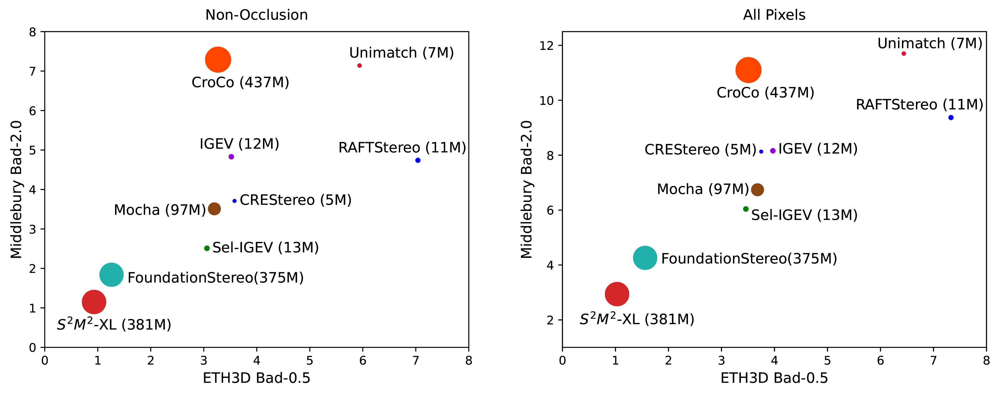

<h3 id="project-title">S2M2: Scalable Stereo Matching Model for Reliable Depth Estimation</h3>
**Junhong Min¹, Youngpil Jeon¹, Jimin Kim¹, Minyong Choi¹**
 
¹Samsung Electronics
 
**International Conference on Computer Vision (ICCV) 2025**

*
Figure 1: Qualitative comparison of 3D point clouds. Compared to SOTA models (Selective-IGEV, FoundationStereo), our model shows more reliable reconstructions in fine structures like bicycle spokes.
*

<h4>Resources</h4>

[**Paper**](https://arxiv.org/abs/2507.13229) | [**Supplement**](ICCV_2025_supp_camera_ready.pdf) | [**Poster**](iccv25_poster_final_v2.png) | [**Code**](https://github.com/junhong-3dv/s2m2)

---

<h4>Abstract</h4>
> The pursuit of a generalizable stereo matching model, capable of performing well across varying resolutions and disparity ranges without dataset-specific fine-tuning, has revealed a fundamental trade-off. Iterative local search methods achieve high scores on constrained benchmarks, but their core mechanism inherently limits the global consistency required for true generalization. However, global matching architectures, while theoretically more robust, have historically been rendered infeasible by prohibitive computational and memory costs. We resolve this dilemma with S2M2: a global matching architecture that achieves state-of-the-art accuracy and high efficiency without relying on cost volume filtering or deep refinement stacks. Our design integrates a multi-resolution transformer for robust long-range correspondence, trained with a novel loss function that concentrates probability on feasible matches. This approach enables a more robust joint estimation of disparity, occlusion, and confidence. S2M2 establishes a new state of the art on Middlebury v3 and ETH3D benchmarks, significantly outperforming prior methods in most metrics while reconstructing high-quality details with competitive efficiency.

---

<h4>Motivation & Objective</h4>
Prior stereo matching models struggled to generalize across diverse input conditions. Attempts to scale models often led to inefficiencies, revealing a need for a more adaptable solution. We aim to develop a unified architecture that achieves:
<ul>
  <li><strong>Input Scalability:</strong> Robust performance across varying image resolutions and disparity ranges.</li>
  <li><strong>Model Scalability:</strong> Consistent performance gains with increased model capacity.</li>
</ul>

---

<h4>Highlights</h4>
Our key contributions include:
<ul>
  <li><strong>A Highly Scalable Global Matching Architecture:</strong> A multi-resolution Transformer architecture scalable in terms of both input (high resolutions, large disparities) and model size.</li>
  <li><strong>Accurate and Reliable Depth Estimation:</strong> A novel loss function that boosts disparity accuracy, while the joint estimation of confidence and occlusion ensures final depth reliability.</li>
  <li><strong>New SOTA and a Rigorous Validation Framework:</strong> State-of-the-art performance on established real-world benchmarks, and a novel synthetic dataset to validate robustness in scenarios unaddressed by existing benchmarks.</li>
</ul>

---

<h4>Method</h4>
Our proposed model, S2M2, is designed to revitalize the global matching paradigm by addressing its long-standing scalability challenges. To achieve this, our architecture is composed of four main stages, as illustrated in the figure below: (1) **Feature Extraction**, (2) **Global Matching**, (3) **Refinement**, and (4) **Upsampling**.

*
Figure 2: Overview of the S2M2 architecture. It consists of a hierarchical feature extraction stage with a Multi-Resolution Transformer (MRT) and an Adaptive Gated Fusion Layer (AGFL), a global matching stage using Optimal Transport, and iterative refinement and upsampling stages.
*

<h5>Key Components:</h5>
<ul>
  <li><strong>Multi-Resolution Transformer (MRT):</strong> Employs a hybrid attention strategy—horizontal 1D attention at high resolutions and 2D attention at the coarsest level—to strike a critical balance between performance and computational cost.</li>
  <li><strong>Adaptive Gated Fusion Layer (AGFL):</strong> Acts as a dynamic gate to selectively fuse features across different scales, ensuring a powerful and coherent multi-scale representation.</li>
  <li><strong>Optimal Transport for Global Matching:</strong> Establishes robust long-range correspondences by finding a globally optimal transport plan, making it robust to ambiguities like occlusions and repetitive patterns.</li>
  <li><strong>Probabilistic Mode Concentration (PMC) Loss:</strong> Our model is trained with a composite loss function that combines standard L1 losses with our novel PMC loss. Since global matching is performed on 1/4-downsampled features, a more direct mechanism is required to guide the matching probabilities. PMC loss directly regularizes the matching probability distribution, encouraging it to concentrate on valid disparity candidates, which boosts accuracy and enables confident predictions.</li>
</ul>

   <em>Illustration of our Probabilistic Mode Concentration (PMC) Loss.</em>

---

<h4>Results</h4>

<h5>3D Visualization</h5>

<h6>Middlebury Benchmark Comparison</h6>
<table class="video-table">
  <tr>
    <td colspan="3">
<strong>Bicycle</strong>
</td>
  </tr>
  <tr>
    <td>
      <video controls autoplay loop muted playsinline>
        <source src="video/foundationstereo_Bicycle_encoding.mp4" type="video/mp4">
        Your browser does not support the video tag.
      </video>
      
<em>FoundationStereo</em>

    </td>
    <td>
      <video controls autoplay loop muted playsinline>
        <source src="video/s2m2_Bicycle_encoding.mp4" type="video/mp4">
        Your browser does not support the video tag.
      </video>
      
<em>S2M2 (Ours)</em>

    </td>
  </tr>
</table>

<table class="video-table">
  <tr>
    <td colspan="3">
<strong>Staircase</strong>
</td>
  </tr>
  <tr>
    <td>
      <video controls autoplay loop muted playsinline>
        <source src="video/foundationstereo_Staircase_encoding.mp4" type="video/mp4">
        Your browser does not support the video tag.
      </video>
      
<em>FoundationStereo</em>

    </td>
    <td>
      <video controls autoplay loop muted playsinline>
        <source src="video/s2m2_Staircase_encoding.mp4" type="video/mp4">
        Your browser does not support the video tag.
      </video>
      
<em>S2M2 (Ours)</em>

    </td>
  </tr>
</table>

<h6>Performance on Transparent/Reflective Objects (Booster Dataset)</h6>
<table class="video-table">
  <tr>
    <td>
      <video controls autoplay loop muted playsinline>
        <source src="video/s2m2_Barrel_encoding.mp4" type="video/mp4">
        Your browser does not support the video tag.
      </video>
      
<em>Barrel</em>

    </td>
    <td>
      <video controls autoplay loop muted playsinline>
        <source src="video/s2m2_Bottles_encoding.mp4" type="video/mp4">
        Your browser does not support the video tag.
      </video>
      
<em>Bottles</em>

    </td>
    <td>
      <video controls autoplay loop muted playsinline>
        <source src="video/s2m2_Lid_encoding.mp4" type="video/mp4">
        Your browser does not support the video tag.
      </video>
      
<em>Lid</em>

    </td>
  </tr>
</table>

<h5>Benchmark Performance</h5>
**As of July 2025, it ranks first on both the [ETH3D](https://www.eth3d.net/low_res_two_view) and [Middlebury v3](https://vision.middlebury.edu/stereo/eval3/) leaderboards.**

*
ETH3D low-res two-view benchmark (July 2025).
*

*
Middlebury v3 benchmark (July 2025).
*

*
Comprehensive evaluation on ETH3D (Bad-0.5) and Middlebury v3 (Bad-2.0). Lower is better. Circle size indicates model parameters.
*

<h5>Scalability Analysis</h5>
Our S2M2 family forms a compelling Pareto front, offering significantly better performance at every level of computational budget and validating the scalability of our architecture.

*
Accuracy vs. Efficiency (Synthetic Benchmark). The S2M2 family (red) achieves higher or comparable accuracy with significantly less computation than larger models like FoundationStereo (cyan).
*

<h5>Our High-Resolution Synthetic Dataset</h5>
To rigorously test our model, we created a new high-resolution synthetic dataset using Blender. This dataset includes challenging scenarios like complex objects, reflective surfaces, and large disparity ranges, which are often not covered by existing benchmarks.

*
Overview of our high-resolution synthetic data generation using Blender.
*

---

<h4>Critical Re-evaluation of the KITTI Benchmark</h4>
We argue that the KITTI benchmark's leaderboard scores are an unreliable indicator of true generalization due to the inherent noise and systematic biases in its LiDAR-based ground truth.

Our analysis shows a contradiction: while fine-tuning on KITTI improves error metrics like EPE, it simultaneously degrades photometric consistency (measured by SSIM), suggesting overfitting to dataset artifacts. The visualizations below show how fine-tuned models produce distorted structures that align with noisy GT labels rather than the actual image content.

*
Figure 5: Negative effects of fine-tuning on KITTI. Zero-shot models (FoundationStereo, S2M2) reconstruct clean 3D structures, whereas fine-tuned models adapt to noise in the GT annotation, resulting in distorted geometry.
*